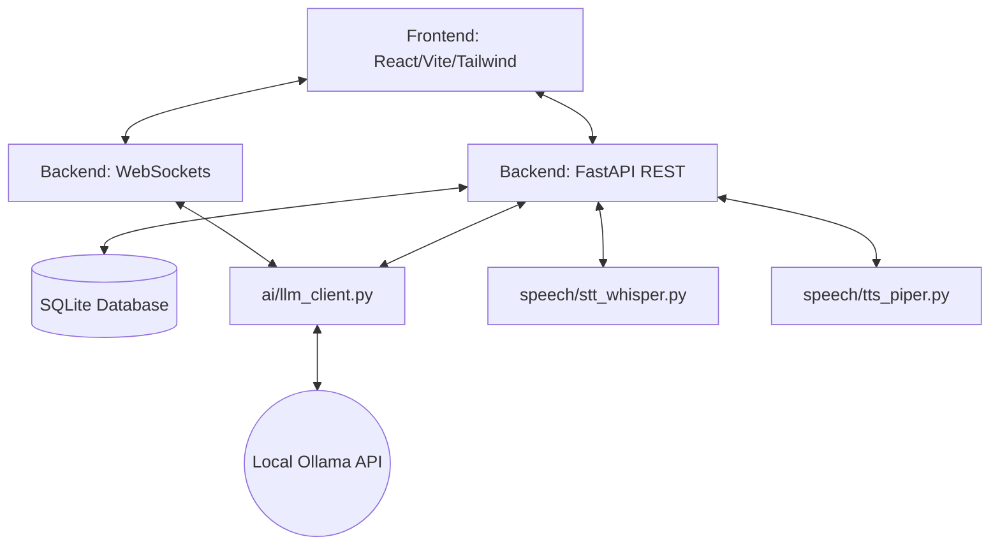

# System Architecture

## Monorepo Overview

## Key Components

1. **Frontend (React)**:
   - Built with Vite. Uses Tailwind for glassmorphic CSS styling.
   - Communicates with FastAPI using Axios (`lib/api.js`) and native `WebSocket` API for streaming LLM chunks.
   
2. **Backend (FastAPI)**:
   - State managed via SQLite. Uses SQLAlchemy ORM models.
   - Pydantic schemas enforce type safety on endpoints.
   
3. **AI Core (`ai/`)**:
   - `llm_client.py`: Abstracts API calls to Ollama. Extracts text, cleans markdown blocks, and parses JSON output for quizzes. It features offline mock fallbacks if the local LLM server goes down.
   - `memory_store.py`: Aggregates the last 5 study sessions and quizzes with <70% scores directly from the DB to build a unique context string injected into the LLM system prompt.
   
4. **Speech Subsystem (`speech/`)**:
   - Built to handle heavy dependencies optionally. If `faster-whisper` fails to load, it falls back to PySTT or mock texts. If `piper` binary isn't found, it generates a fallback WAV chime so the UI `<audio>` tags don't throw errors.
